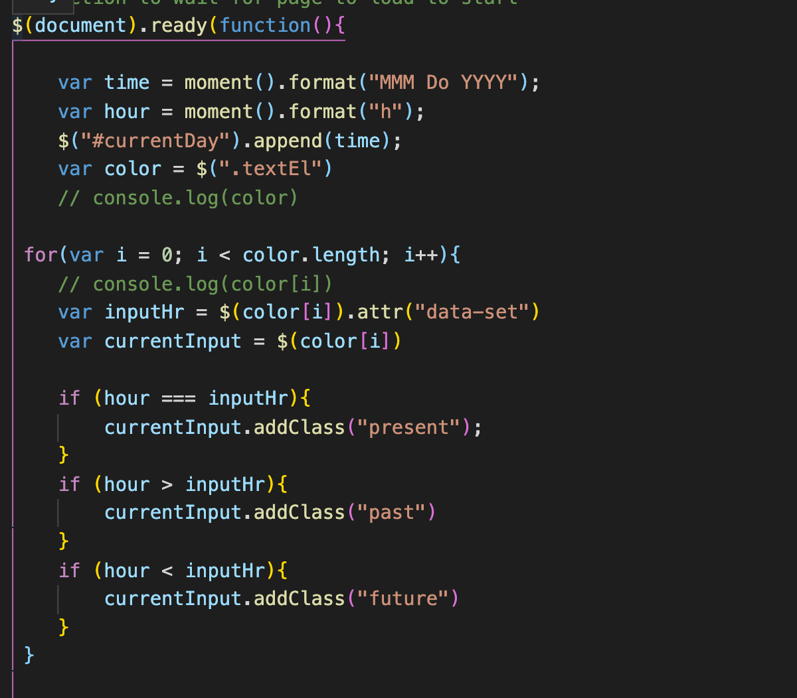

# Schedule_Saver

## Description 
Have a busy day?  Use this application to help you manage your time more effectively.  You can add a days worth of events to this planner, navigate out of your window, and return to find your schedule right where you left off.  The color block will change depending on the hour of the day to help guide you from task to task.  At the end of the day clear the entire schedule and begin planning for the next day.  

## Link to project 
[Schedule_Saver](https://lauragwendolynburch.github.io/Schedule_Saver/)

## Sample of Project 

## Sample of JavaScript

## User Notes
This was a nice way to work with new a new api. jQuery is a bit easier to work with than vanilla JS.  

## License
N/A